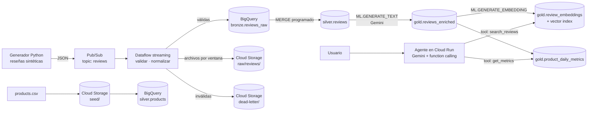

# Review Pulse

Streaming de reseñas de clientes con enriquecimiento por IA generativa en Google Cloud.

Un e-commerce recibe miles de reseñas al día, pero el equipo de producto solo ve el promedio de estrellas y no sabe **por qué** sube o baja la satisfacción. Review Pulse ingiere las reseñas en tiempo real, las clasifica con Gemini (sentimiento, tema y resumen) y expone un agente que responde preguntas como:

> *"¿Por qué bajó la calificación de los audífonos esta semana?"*

Para responderlas, el agente cruza la métrica (SQL sobre BigQuery) con las reseñas que la explican (búsqueda vectorial).

## Estado

| Fase | Alcance | Estado |
|---|---|---|
| 1. Base | Infraestructura con Terraform y generador de eventos | ✅ Desplegada y verificada |
| 2. Streaming | Pipeline de Dataflow: validación, bronze, GCS y dead-letter | 🚧 Verificado en Dataflow; falta la Flex Template |
| 3. Capas y LLM | MERGE a silver, enriquecimiento con Gemini, embeddings y gold | Pendiente |
| 4. Agente | API en Cloud Run con function calling | Pendiente |
| 5. CI y demo | GitHub Actions y demo del escenario de incidente | Pendiente |

## Arquitectura



**Stack:** Pub/Sub · Dataflow (Apache Beam, Python) · Cloud Storage · BigQuery y BigQuery ML · Vertex AI (Gemini y embeddings) · Cloud Run · Terraform

Tres decisiones definen el diseño:

- **La deduplicación ocurre en silver, no en el streaming.** Dataflow solo valida y enruta. Un MERGE idempotente en BigQuery garantiza que cada `review_id` aparezca una sola vez, así la idempotencia vive en un solo lugar.
- **Gemini se llama en micro-batch desde BigQuery, no evento por evento.** Reduce el costo, evita problemas de cuotas y reintentos en el streaming, y permite re-enriquecer el histórico si cambia el prompt.
- **El agente no genera SQL libre.** Usa dos herramientas con consultas parametrizadas, lo que lo hace predecible y seguro.

El razonamiento detrás de cada decisión está en [`docs/decisions.md`](docs/decisions.md).

## Cómo correrlo

**Requisitos:** Terraform ≥ 1.5, Python 3.11+, `gcloud` con credenciales de aplicación (`gcloud auth application-default login`) y un proyecto de GCP con facturación.

```bash
# 1. Infraestructura
cd infra
cp terraform.tfvars.example terraform.tfvars   # completar project_id
terraform init && terraform apply

# 2. Generador
cd ..
python -m venv .venv && .venv/Scripts/activate   # en Linux/macOS: source .venv/bin/activate
pip install -r generator/requirements.txt

python generator/publish.py --dry-run --rate 60 --duration 1              # sin GCP, imprime eventos
python generator/publish.py --project <PROJECT_ID> --rate 20 --duration 10
python generator/publish.py --project <PROJECT_ID> --incident-start 2 --incident-minutes 5

# 3. Tests
pip install -r pipelines/dataflow/requirements.txt
python tests/test_generator.py
python tests/test_pipeline.py

# 4. Pipeline en Dataflow (requiere Java: la escritura a BigQuery es cross-language)
bash scripts/run_dataflow.sh      # toma toda la configuración de `terraform output`
bash scripts/stop.sh              # drain del job; --cancel para detenerlo de inmediato
bash scripts/down.sh              # cancela los jobs y ejecuta terraform destroy
```

El generador inyecta a propósito casos que el pipeline debe manejar: JSON mal formado, eventos que rompen reglas de validación, duplicados exactos, eventos que llegan con horas de retraso y un incidente de reseñas negativas sobre conectividad para un producto.

### Validación de punta a punta

El generador es determinista: con la misma semilla produce siempre los mismos eventos, así que el resultado correcto se conoce antes de correr. `scripts/reconcile.py` lo calcula y lo compara con tres mediciones independientes: los contadores de Dataflow, lo que llegó a bronze y a `raw/`, y la dead-letter agrupada por motivo.

```
outcome             expected  counters    landed
valid                    288       288       288
malformed_json             4         4         4
missing_fields             3         3         3
invalid_rating             4         4         4
invalid_event_ts           1         1         1

raw/ lines 288 vs bronze rows 288
RECONCILED
```

## Costos

Sin procesos corriendo, la infraestructura cuesta prácticamente cero. El costo principal es Dataflow mientras procesa datos (del orden de USD 0,25–0,40 por hora con un worker), por eso se ejecuta solo durante las sesiones de prueba. `terraform destroy` deja el proyecto limpio y `terraform apply` lo vuelve a levantar. Una alerta de presupuesto opcional (`billing_account` en `terraform.tfvars`) avisa al 50%, 90% y 100% del monto definido.

## Estructura

```
infra/                Terraform: APIs, bucket, Pub/Sub, datasets, tabla bronze, IAM y presupuesto
generator/            Publicador de reseñas sintéticas y catálogo de productos
pipelines/dataflow/   Pipeline de streaming (Apache Beam) y schema de bronze
scripts/              Lanzar, detener, desmontar y conciliar
tests/                Tests del generador y del pipeline
docs/                 Decisiones de diseño (ADRs) y guía paso a paso
```

Para entender cada pieza y reconstruir el sistema a mano, sin Terraform, está la [guía paso a paso](docs/guia/README.md).
