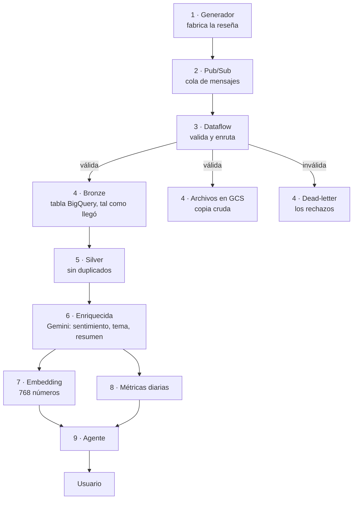
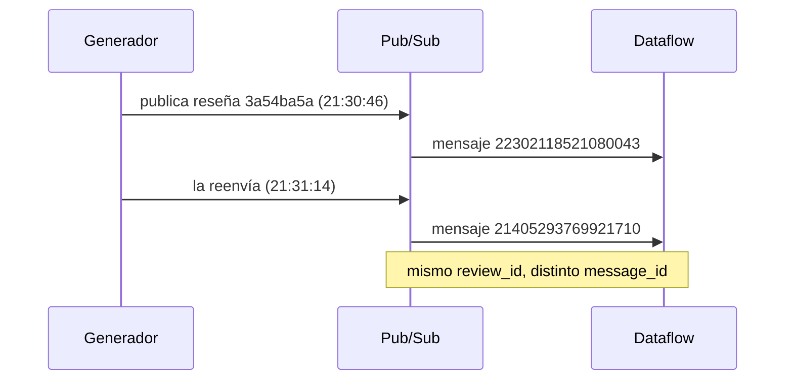
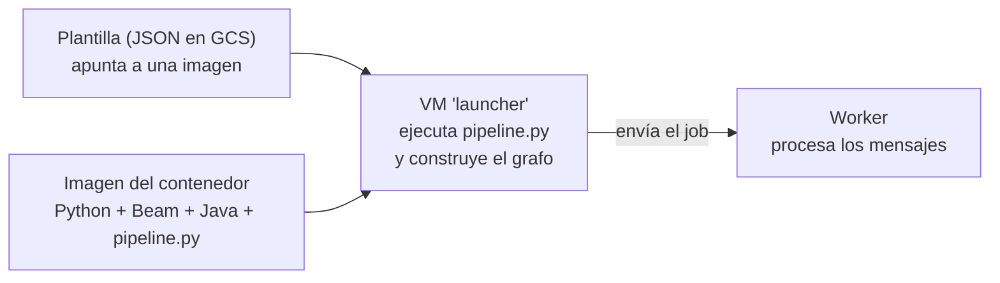
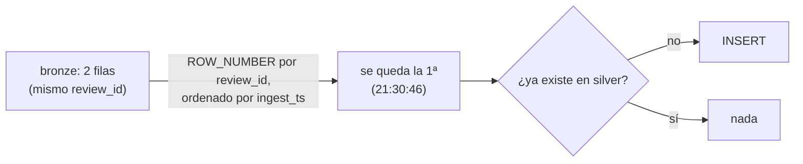
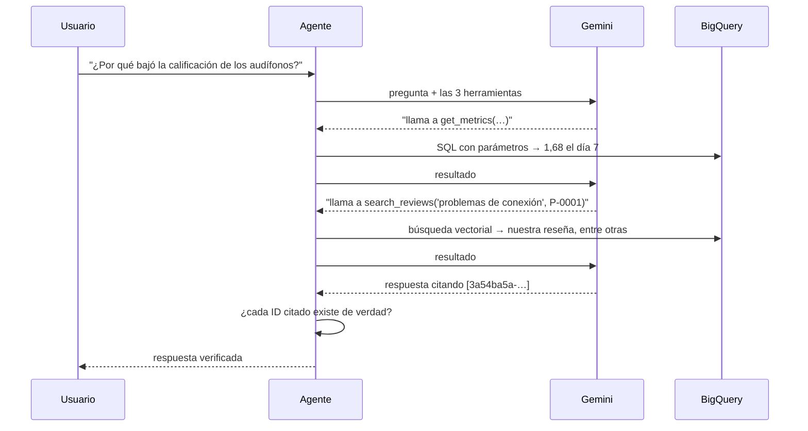
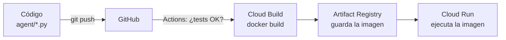

# 00 · De cero a punta: una reseña, de principio a fin

Este capítulo no explica decisiones: explica **cómo funciona**, desde cero, siguiendo una sola reseña real por todo el sistema. Cada etapa tiene el mismo esquema:

1. **Qué ocurre**, en palabras simples.
2. **El concepto base**, explicado como si fuera la primera vez.
3. **El dato real** de esta reseña en ese punto.
4. **Qué archivo lo hace.**
5. **Qué pasaría si falla.**

La reseña que seguimos existe de verdad en el proyecto:

> **Producto** P-0001 (audífonos inalámbricos) · **Título** "El Bluetooth falla" · **Texto** "Se corta la señal aunque el teléfono esté al lado." · **Calificación** 1 · **ID** `3a54ba5a-0783-42c7-83ac-2ec1870d6e37`

La elegí porque tiene una particularidad: **llegó dos veces**. Eso permite ver con datos reales cómo se maneja un duplicado.

## El mapa completo



Tres ideas atraviesan todo el sistema; conviene tenerlas claras antes de empezar.

**Idea 1 · Todo es un archivo o una fila que se transforma.** No hay magia: cada etapa lee datos de un sitio, los cambia un poco y los escribe en otro.

**Idea 2 · "Al menos una vez".** En sistemas distribuidos es más fácil garantizar que un mensaje llega *una o más veces* que *exactamente una*. Por eso aparecen duplicados, y por eso silver existe.

**Idea 3 · Cada pieza tiene una identidad.** Nada en la nube actúa "como tú": cada servicio usa su propia cuenta con permisos mínimos. Es lo que más cuesta entender y lo que más errores produjo.

---

## Etapa 1 · El generador crea la reseña

**Qué ocurre.** Un script Python inventa una reseña y la envía. En un negocio real, esto lo haría la web o la app de la tienda cuando un cliente escribe una opinión.

**Concepto base: JSON.** Es la forma estándar de escribir datos como texto: pares `"campo": valor` entre llaves. Cualquier lenguaje lo entiende.

**El dato real.** Lo que sale del generador es solo texto:

```json
{"review_id": "3a54ba5a-0783-42c7-83ac-2ec1870d6e37", "product_id": "P-0001",
 "customer_id": "C-1199", "rating": 1, "title": "El Bluetooth falla",
 "body": "Se corta la señal aunque el teléfono esté al lado.",
 "channel": "app", "event_ts": "2026-10-07T21:30:46Z"}
```

Fíjate en lo que **no** trae: ni el sentimiento ni el tema. Eso lo averiguará Gemini después, como pasaría con reseñas reales.

**Cómo elige el texto.** De `generator/review_bank.json`, 227 reseñas que Gemini escribió una vez. Con `--seed` el resultado es siempre el mismo, lo que permite saber de antemano qué debe aparecer en cada etapa.

**Qué más hace a propósito:** envía JSON roto, reseñas sin campos, calificaciones imposibles y **duplicados** (el 2 %). Es para comprobar que el resto del sistema los maneja.

**Archivo:** `generator/publish.py`. **Si falla:** no hay reseñas nuevas; el resto sigue igual.

---

## Etapa 2 · Pub/Sub: la cola

**Qué ocurre.** El generador no habla con Dataflow. Deja el mensaje en una *cola* y se desentiende.

**Concepto base: cola de mensajes.** Es un buzón entre quien produce datos y quien los consume. Desacopla a los dos: si el consumidor está caído, los mensajes esperan (hasta 7 días); si llegan muchos de golpe, se acumulan en lugar de perderse.

Dos palabras que se confunden:

| Término | Qué es | Analogía |
|---|---|---|
| **Topic** (`reviews`) | Donde se publica | El buzón de la oficina |
| **Subscription** (`reviews-dataflow-sub`) | Una copia de la cola para un consumidor | La bandeja de cada persona que recibe copia |

Hay dos subscriptions sobre el mismo topic: una para Dataflow y otra, del experimento, que escribe directo en BigQuery. Cada una recibe todos los mensajes por separado.

**De dónde salen los duplicados.** Hay dos causas distintas, y se distinguen por el `message_id`:

| Causa | Qué pasa | `message_id` |
|---|---|---|
| **Reenvío de Pub/Sub** | Entrega *al menos una vez*: si no recibe confirmación a tiempo (60 s), vuelve a enviar el mismo mensaje | **El mismo** |
| **El productor publica dos veces** (un reintento de la app, o el generador a propósito, 2 %) | Son dos mensajes distintos con el mismo contenido | **Distinto** |

Nuestra reseña es del segundo tipo, como muestra el diagrama.



La clave: **`review_id` identifica la reseña; `message_id` identifica el mensaje.** Dos mensajes distintos, una misma reseña. Por eso la deduplicación usa `review_id`: un reenvío de Pub/Sub y una publicación doble terminan igual de resueltos.

**Archivo:** `infra/pubsub.tf`. **Si falla:** los mensajes esperan; no se pierden.

---

## Etapa 3 · Dataflow: validar y enrutar

**Qué ocurre.** Un proceso lee la cola continuamente, comprueba cada mensaje y lo manda a su destino.

**Concepto base: streaming.** Un proceso *batch* arranca, lee un conjunto de datos finito y termina. Uno de *streaming* queda encendido para siempre y procesa cada dato según llega. Por eso Dataflow **cobra por hora encendido** y se apaga a mano.

**Qué es Dataflow y qué es Beam.** *Apache Beam* es una biblioteca para describir el procesamiento ("lee de aquí, valida, escribe allá"). *Dataflow* es el servicio de Google que ejecuta ese programa en máquinas que él mismo gestiona.

**El dato real.** `validate()` recibe los bytes del mensaje y los somete a estas reglas, en orden:

| # | Regla | Si falla, motivo |
|---|---|---|
| 1 | ¿Es JSON válido? | `malformed_json` |
| 2 | ¿Es un objeto (llaves)? | `not_an_object` |
| 3 | ¿Están todos los campos? | `missing_fields:…` |
| 4 | ¿`rating` es un entero entre 1 y 5? | `invalid_rating` |
| 5 | ¿Los demás campos son texto? | `invalid_type` |
| 6 | ¿`event_ts` es una fecha con zona horaria? | `invalid_event_ts` |

Nuestra reseña pasa las seis. Se convierte en una fila con dos campos nuevos que añade el sistema: `ingest_ts` (cuándo entró) y `message_id`.

**Dónde corre el código (lo que más confunde).** Hay tres "máquinas" distintas:



- La **imagen** contiene el programa empaquetado.
- El **launcher** corre una vez para armar el plan del trabajo (por eso hace falta Java: el conector hacia BigQuery está escrito en Java).
- El **worker** es la máquina que de verdad procesa mensajes, y usa su propia imagen oficial de Beam.

Por eso lanzar el job tarda 3-4 minutos: arranca primero el launcher y después el worker.

**Contadores.** Cada resultado incrementa un contador (`valid`, `malformed_json`…). Sirven para la conciliación: al final se comprueba que lo que contó Dataflow es lo que llegó a cada destino.

**Archivo:** `pipelines/dataflow/pipeline.py`. **Si falla:** los mensajes siguen en Pub/Sub, sin confirmar; al reiniciar se procesan.

---

## Etapa 4 · Tres destinos

Lo válido va a **dos sitios** a la vez y lo inválido a un tercero.

### 4a · Bronze (BigQuery)

**Concepto base: BigQuery.** Es una base de datos de Google diseñada para analizar muchísimos datos con SQL. Se organiza en *proyecto → dataset → tabla*. "Bronze" es el nombre de la primera capa: los datos **tal como llegaron, sin arreglar**.

**El dato real.** Nuestra reseña aparece **dos veces** en `bronze.reviews_raw`:

| review_id | message_id | ingest_ts |
|---|---|---|
| `3a54ba5a-…` | `22302118521080043` | 21:30:46 |
| `3a54ba5a-…` | `21405293769921710` | 21:31:14 |

Mismo `review_id`, distinto `message_id`: el duplicado, 28 segundos después. Bronze no lo corrige a propósito; su trabajo es reflejar lo que llegó.

**Partición.** La tabla se divide por día de `ingest_ts` y exige filtrar por fecha en cada consulta, para no leerla entera por accidente (cobra por datos leídos).

### 4b · Archivos en GCS

La misma reseña se guarda como línea en un archivo de texto en Cloud Storage: `raw/reviews/dt=2026-10-07/reviews-HHMM-p0.jsonl`, **un archivo por ventana de 5 minutos** (`HHMM` es la hora de inicio). Es la copia de seguridad barata: si bronze se corrompe, se reconstruye desde aquí.

**Concepto base: ventana.** En streaming no hay "fin" donde cerrar un archivo, así que se agrupan los datos por intervalos de tiempo.

### 4c · Dead-letter

Lo que no pasó las reglas va a `dead-letter/` con su motivo. Es lo opuesto a perder datos en silencio: cada rechazo queda guardado y explicado.

**Archivos:** `pipelines/dataflow/pipeline.py`, `schemas/`. **Si falla un destino:** Dataflow reintenta; la conciliación detecta cualquier diferencia.

---

## Etapa 5 · Silver: una fila por reseña

**Qué ocurre.** Se leen las filas de bronze y se descartan las repetidas.

**Concepto base: `MERGE` idempotente.** *Idempotente* significa "ejecutarlo dos veces da lo mismo que una". El `MERGE` compara lo que viene con lo que ya existe: si la reseña no está, la inserta; si está, no hace nada.



**El dato real.** En silver solo hay **una fila**, con `first_ingest_ts = 21:30:46` (la primera copia) y `loaded_at = 21:41:45` (cuándo se cargó).

**Por qué aquí y no en Dataflow.** La deduplicación vive en un solo lugar. Hacerlo en streaming exigiría recordar todo lo visto y duplicaría el costo.

**Archivo:** `sql/silver/reviews.sql`, ejecutado con `scripts/run_sql.sh`. **Si falla:** nada se pierde; se vuelve a ejecutar y el resultado es idéntico.

---

## Etapa 6 · Gemini la clasifica

**Qué ocurre.** BigQuery le envía el texto a Gemini y guarda la respuesta estructurada.

**Concepto base: modelo remoto.** BigQuery no contiene Gemini. Un *modelo remoto* es un nombre dentro de BigQuery (`gold.gemini`) que apunta a un servicio de Google. Para llamarlo hace falta una *conexión*, que es la identidad con la que BigQuery se presenta ante Vertex AI.

**El dato real.** El prompt incluye título, texto y calificación, más la instrucción: *"el tema debe ser exactamente uno de: battery, connectivity, …"*. La respuesta:

```json
{"sentiment": "negative", "topic": "connectivity",
 "summary": "La señal de Bluetooth se corta constantemente, incluso cerca del teléfono."}
```

**Por qué una lista cerrada de temas.** Con texto libre salieron `battery` y `battery life` para lo mismo, y un `GROUP BY` los habría contado por separado. La instrucción va **después** del texto de la reseña y con temperatura 0: en la primera prueba, la lista al principio la respetó solo el 15 %.

**Solo procesa lo nuevo.** Una reseña ya enriquecida no se vuelve a enviar: ahorra dinero.

**Archivo:** `sql/enrichment/reviews_enriched.sql`. **Si falla:** la fila no se guarda y la próxima ejecución la reintenta.

---

## Etapa 7 · El embedding: significado convertido en números

**Qué ocurre.** El texto se transforma en una lista de 768 números.

**Concepto base.** Un *embedding* es una coordenada en un mapa gigante de significados. Textos que quieren decir lo mismo quedan cerca; los que no, lejos, aunque no compartan ni una palabra. La cercanía se mide con la *distancia coseno* (0 = idéntico).

**El dato real.**

```
texto: "El Bluetooth falla. Se corta la señal aunque el teléfono esté al lado."
embedding (768 números, los 6 primeros): -0.0044, 0.0063, 0.0040, -0.0658, -0.0142, -0.0380 …
```

Esos números no significan nada por separado; solo importan en comparación con los de otros textos. La pregunta "se desconectan solos del celular" se convierte en otro vector y queda a distancia **0,097** de una reseña que dice "pierde conexión y hay que emparejarlo de nuevo".

**La regla de oro:** la pregunta y las reseñas deben convertirse con el **mismo modelo y las mismas opciones**. Si no, los números viven en mapas distintos.

**Archivo:** `sql/enrichment/review_embeddings.sql`. **Si falla:** la reseña sigue en gold sin vector; se reintenta.

---

## Etapa 8 · Métricas diarias

**Qué ocurre.** Se resumen todas las reseñas enriquecidas por producto y por día.

**El dato real.** Nuestra reseña es una de las 176 de P-0001 del 7 de octubre:

| Fecha | Producto | Reseñas | Calificación media | Negativas | % negativo | Tema principal negativo |
|---|---|---|---|---|---|---|
| 2026-10-07 | P-0001 | 176 | 1,68 | 164 | 93,2 % | connectivity |

Los días anteriores (2 al 6 de octubre) la calificación estaba entre 3,6 y 4,2. Esa diferencia es el incidente que el agente va a explicar.

**Por qué una tabla aparte.** Para responder "¿cuánto bajó?" no hace falta releer miles de reseñas: basta una fila por día.

**Archivo:** `sql/gold/product_daily_metrics.sql`.

---

## Etapa 9 · El agente

**Qué ocurre.** Un usuario pregunta en lenguaje natural y el agente contesta con datos y evidencia.

**Concepto base: function calling.** Gemini no consulta BigQuery. Se le describen tres funciones; cuando las necesita, responde "llama a esta función con estos argumentos". El código ejecuta y le devuelve el resultado.



**Dos protecciones esenciales:**

- **Sin SQL libre.** El modelo solo rellena valores de consultas fijas, y cada valor se valida antes.
- **Citas verificadas.** Cada `review_id` que la respuesta menciona debe haber sido devuelto por una herramienta. En la primera prueba, Gemini inventó cinco reseñas con IDs falsos; esta comprobación lo detectó.

**Archivos:** `agent/agent.py`, `agent/tools.py`, `agent/app.py`.

---

## Los cimientos: lo que hace que todo lo anterior exista

Las nueve etapas son lo que *ocurre*. Esto es lo que las *crea y mantiene*.

### Terraform: la infraestructura como código

**Concepto base.** En vez de crear recursos haciendo clic en una consola, se **describen en archivos** y Terraform los crea. Ventajas: es repetible (se levanta todo con un comando), versionable (cada cambio queda en Git) y destruible (`terraform destroy` limpia sin dejar restos).

Terraform guarda un *estado*: un archivo con lo que cree que existe. Compara ese estado con tus archivos y calcula el plan (`plan`), luego lo aplica (`apply`). Hoy el estado es un archivo local, lo cual es válido para un proyecto personal pero no para un equipo.

### Contenedores: por qué existe el Dockerfile

**Concepto base.** Un programa depende de su entorno: la versión de Python, las bibliotecas instaladas. Un *contenedor* empaqueta el programa **con** su entorno, de modo que corre igual en cualquier sitio. El **Dockerfile** es la receta de ese paquete; el resultado es una *imagen*.

Cloud Run, el launcher de Dataflow y el agente funcionan así: ninguno ejecuta código "suelto".

### La cadena de despliegue del agente



- **Cloud Build** es una máquina de Google que construye la imagen (para no depender de tu equipo).
- **Artifact Registry** es el almacén de imágenes.
- **Cloud Run** ejecuta una imagen y la expone como API; escala a cero cuando nadie la usa.
- **GitHub Actions** automatiza el recorrido en cada push. Para entrar a Google usa **Workload Identity Federation**: en lugar de una contraseña guardada, GitHub presenta un token temporal que Google verifica.

### Las identidades (cuentas de servicio)

Cada pieza usa su propia cuenta con los permisos justos:

| Cuenta | Para qué | Qué NO puede |
|---|---|---|
| `dataflow-runner` | Ejecutar el pipeline | Tocar gold o el agente |
| `builder` | Construir imágenes | Desplegar |
| `deployer` | Desplegar desde GitHub | Leer datos |
| `agent` | Ejecutar el agente | Leer bronze o silver |
| conexión de Vertex | BigQuery → Gemini | Todo lo demás |

Si una se compromete, el daño queda acotado. Es también la causa de la mayoría de errores del proyecto: cuando algo falla con `403` o `PERMISSION_DENIED`, casi siempre falta un permiso para *esa* cuenta concreta.

---

## Qué se ejecuta cuándo (y cuánto cuesta)

| Componente | ¿Cobra en reposo? | Quién lo enciende |
|---|---|---|
| Dataflow | **Sí, por hora** | Tú (`run_dataflow.sh`), y se apaga con `stop.sh` |
| Pub/Sub, BigQuery, GCS | Casi nada (almacenamiento) | Siempre existen |
| Gemini y embeddings | Solo cuando se llaman (centavos) | Tú, al ejecutar el SQL |
| Cloud Run | **No** (escala a cero) | Se enciende con una petición |
| Cloud Build | Solo mientras construye | GitHub Actions o tú |

**La regla práctica:** lo único que puede costar de verdad si se olvida es Dataflow. Tras publicar, hacer siempre `bash scripts/stop.sh`.

---

## Cómo comprobar que lo entiendes

Pregúntate sin mirar la guía; si dudas en alguna, esa es la etapa que conviene repasar:

1. ¿Por qué hay dos filas en bronze y una en silver para la misma reseña? ¿Qué campo las distingue?
2. ¿Qué diferencia hay entre un topic y una subscription?
3. ¿Por qué Dataflow se apaga a mano y Cloud Run no?
4. ¿Qué pasa con un mensaje que no es JSON válido? ¿Dónde acaba?
5. ¿Por qué el `MERGE` puede ejecutarse dos veces sin dañar nada?
6. ¿Por qué la pregunta y las reseñas deben usar el mismo modelo de embeddings?
7. ¿Qué evita que el agente cite una reseña inventada?
8. ¿Para qué sirve el Dockerfile, y qué hace Cloud Build con él?
9. Si un despliegue falla con `PERMISSION_DENIED`, ¿qué es lo primero que miras?

## Cómo practicar

Seguir una reseña tú mismo es la mejor forma de fijarlo. Con tu propio proyecto en marcha:

```sql
-- 1. ¿Cuántas veces llegó cada reseña? (bronze exige filtrar por fecha)
SELECT review_id, COUNT(*) AS veces
FROM bronze.reviews_raw
WHERE ingest_ts >= TIMESTAMP '2026-10-07'
GROUP BY review_id HAVING veces > 1 LIMIT 5;

-- 2. Elige un review_id y míralo en cada capa
SELECT * FROM silver.reviews         WHERE review_id = '<ID>';
SELECT * FROM gold.reviews_enriched  WHERE review_id = '<ID>';
SELECT ARRAY_LENGTH(embedding) FROM gold.review_embeddings WHERE review_id = '<ID>';
```

Después, rompe algo a propósito para ver qué pasa: publica con `--invalid-ratio 0.5` y mira qué llega a la dead-letter; ejecuta dos veces el `MERGE` y comprueba que silver no cambia; pregúntale al agente por un producto que no existe.
