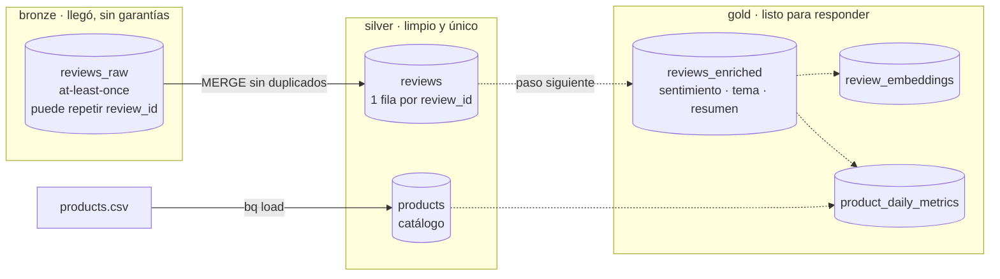
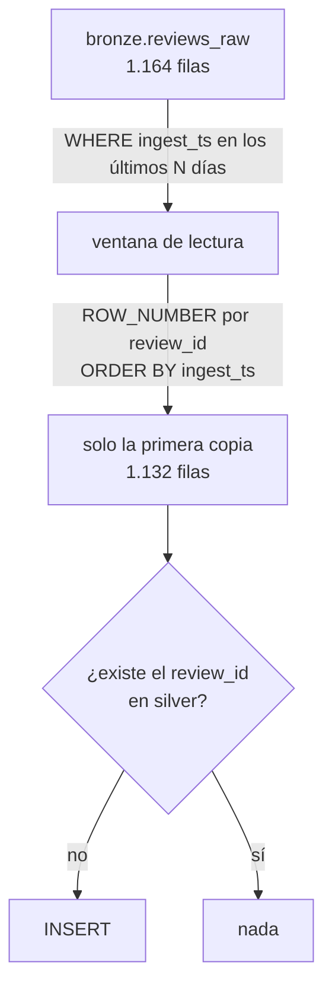
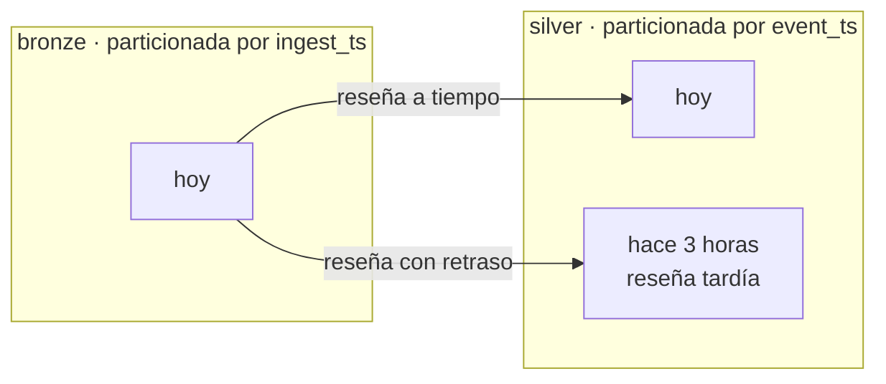

# 06 · Capas de datos: bronze, silver y gold

Hasta la fase 2 los datos llegan a **bronze**, tal como salen del pipeline. Este capítulo cubre cómo se convierten en tablas confiables para consultar. Se completa con cada paso de la Fase 3.

## El mapa



Línea continua: ya construido. Línea punteada: pendiente.

| Capa | Pregunta que responde | Garantía |
|---|---|---|
| bronze | ¿Qué llegó y cuándo? | Ninguna: puede haber duplicados |
| silver | ¿Qué reseñas existen? | Un `review_id` aparece una sola vez |
| gold | ¿Qué significan? | Enriquecidas y agregadas para el agente |

## Silver: deduplicar con un MERGE

Pub/Sub entrega *al menos una vez*, y el generador reenvía el 2 % de los eventos a propósito. Por eso bronze tiene más filas que reseñas. La deduplicación ocurre una sola vez, en silver.



Por qué es seguro ejecutarlo las veces que haga falta:

- **Solo inserta.** Si la fila ya está, no hace nada. Correrlo dos veces, o con ventanas que se solapan, da el mismo resultado (idempotencia).
- **Ventana fija en vez de watermark.** Un watermark ("procesar lo posterior a la última corrida") puede saltarse filas que bronze aún no hacía consultables. Releer una ventana fija no puede perder nada, y la idempotencia hace que releer sea gratis en datos. La decisión completa está en [`decisions.md`](../decisions.md).

### Ejecutarlo

```bash
bash scripts/load_products.sh                              # silver.products desde generator/products.csv
LOOKBACK_DAYS=30 bash scripts/run_sql.sh sql/silver/reviews.sql   # crea silver.reviews y hace el MERGE
```

`LOOKBACK_DAYS` vale 3 por defecto. Se amplía para reprocesar historia, por ejemplo después de borrar silver.

### Comprobarlo

```sql
SELECT
  (SELECT COUNT(*) FROM silver.reviews)                    AS silver_rows,
  (SELECT COUNT(DISTINCT review_id) FROM silver.reviews)   AS silver_distinct,
  (SELECT COUNT(DISTINCT review_id) FROM bronze.reviews_raw
    WHERE ingest_ts >= TIMESTAMP_SUB(CURRENT_TIMESTAMP(), INTERVAL 30 DAY)) AS bronze_distinct;
```

`silver_rows`, `silver_distinct` y `bronze_distinct` deben ser iguales. Si `silver_rows` es mayor que `silver_distinct`, el MERGE está insertando duplicados.

### Particiones



Bronze se ordena por *cuándo llegó* y silver por *cuándo ocurrió*. Una reseña que llega hoy con `event_ts` de hace horas queda en la partición de su fecha real. Las consultas por fecha de reseña leen solo lo necesario.
