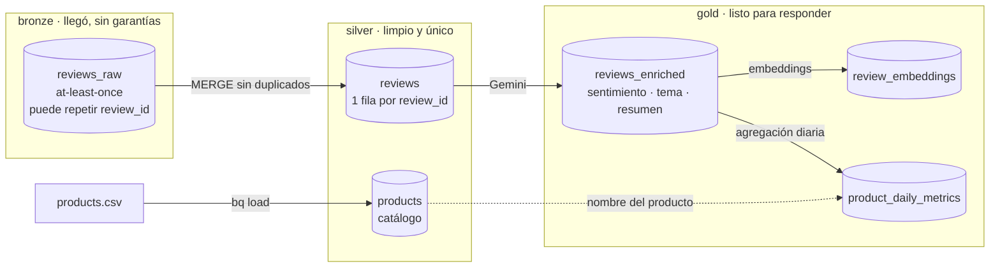
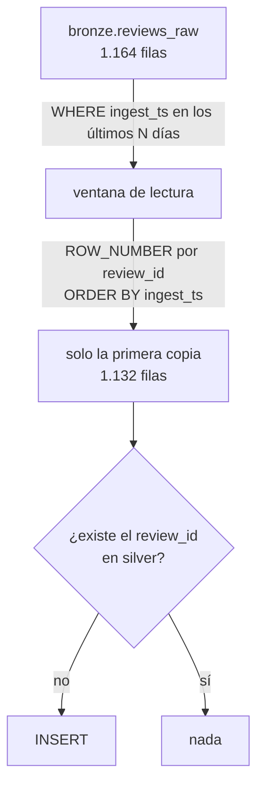
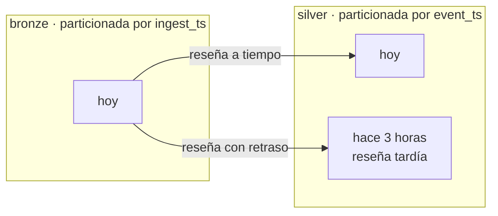
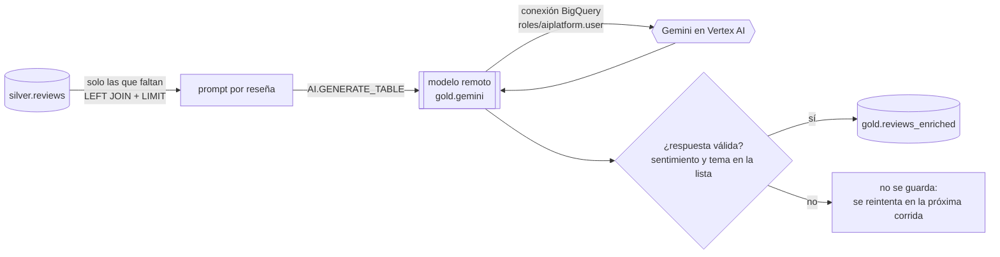
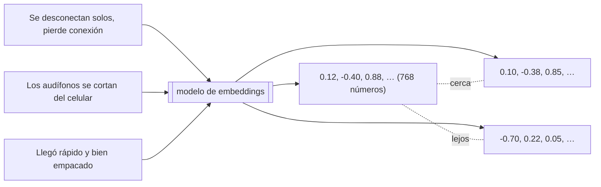
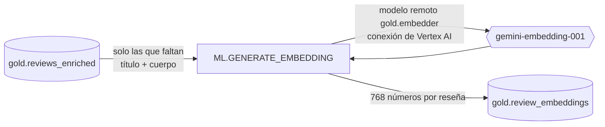
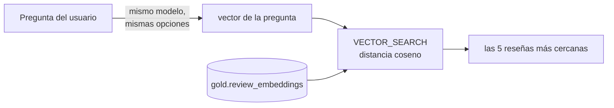
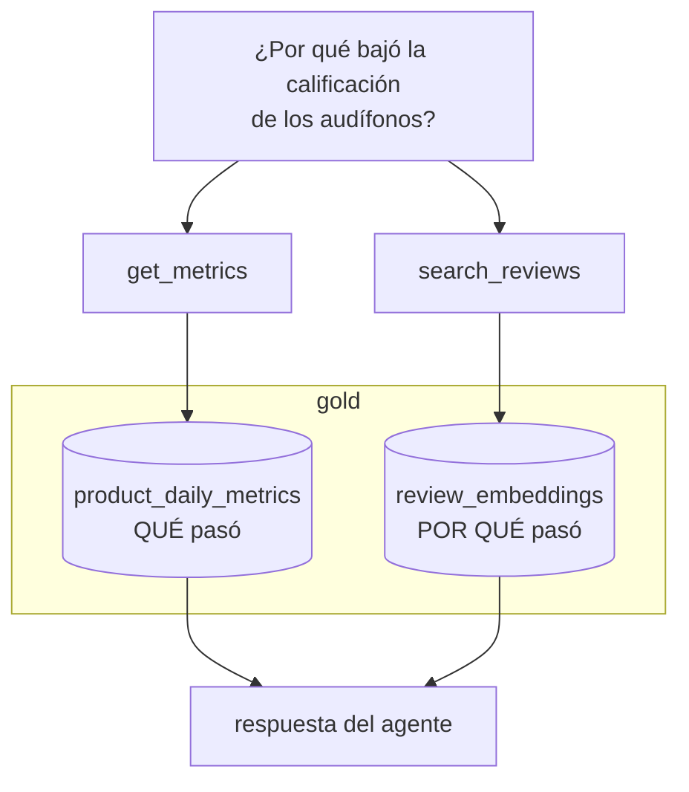

# 06 · Capas de datos: bronze, silver y gold

Hasta la fase 2 los datos llegan a **bronze**, tal como salen del pipeline. Este capítulo cubre cómo se convierten en tablas confiables para consultar. Se completa con cada paso de la Fase 3.

## El mapa



Línea continua: flujo de datos. Línea punteada: uso futuro.

| Capa | Pregunta que responde | Garantía |
|---|---|---|
| bronze | ¿Qué llegó y cuándo? | Ninguna: puede haber duplicados |
| silver | ¿Qué reseñas existen? | Un `review_id` aparece una sola vez |
| gold | ¿Qué significan? | Enriquecidas y agregadas para el agente |

## Silver: deduplicar con un MERGE

Pub/Sub entrega *al menos una vez*, y el generador reenvía el 2 % de los eventos a propósito. Por eso bronze tiene más filas que reseñas. La deduplicación ocurre una sola vez, en silver.



Por qué es seguro ejecutarlo las veces que haga falta:

- **Solo inserta.** Si la fila ya está, no hace nada. Correrlo dos veces, o con ventanas que se solapan, da el mismo resultado (idempotencia).
- **Ventana fija en vez de watermark.** Un watermark ("procesar lo posterior a la última corrida") puede saltarse filas que bronze aún no hacía consultables. Releer una ventana fija no puede perder nada, y la idempotencia hace que releer sea gratis en datos. La decisión completa está en [`decisions.md`](../decisions.md).

### Ejecutarlo

```bash
bash scripts/load_products.sh                              # silver.products desde generator/products.csv
LOOKBACK_DAYS=30 bash scripts/run_sql.sh sql/silver/reviews.sql   # crea silver.reviews y hace el MERGE
```

`LOOKBACK_DAYS` vale 3 por defecto. Se amplía para reprocesar historia, por ejemplo después de borrar silver.

### Comprobarlo

```sql
SELECT
  (SELECT COUNT(*) FROM silver.reviews)                    AS silver_rows,
  (SELECT COUNT(DISTINCT review_id) FROM silver.reviews)   AS silver_distinct,
  (SELECT COUNT(DISTINCT review_id) FROM bronze.reviews_raw
    WHERE ingest_ts >= TIMESTAMP_SUB(CURRENT_TIMESTAMP(), INTERVAL 30 DAY)) AS bronze_distinct;
```

`silver_rows`, `silver_distinct` y `bronze_distinct` deben ser iguales. Si `silver_rows` es mayor que `silver_distinct`, el MERGE está insertando duplicados.

### Particiones



Bronze se ordena por *cuándo llegó* y silver por *cuándo ocurrió*. Una reseña que llega hoy con `event_ts` de hace horas queda en la partición de su fecha real. Las consultas por fecha de reseña leen solo lo necesario.

---

## Gold: enriquecer con Gemini

Las reseñas de silver tienen texto libre. Para responder "¿por qué bajó la calificación?" hacen falta tres datos estructurados por reseña: **sentimiento**, **tema** y **resumen**. Gemini los produce sin salir de BigQuery.



### Piezas

| Pieza | Dónde | Para qué |
|---|---|---|
| Conexión de BigQuery | `infra/enrichment.tf` | La identidad con la que BigQuery llama a Vertex AI |
| Rol `aiplatform.user` | `infra/enrichment.tf` | Permiso de esa identidad para usar Gemini |
| Modelo remoto `gold.gemini` | `sql/enrichment/model.sql` | Un nombre dentro de BigQuery que apunta al endpoint de Gemini |
| Consulta de enriquecimiento | `sql/enrichment/reviews_enriched.sql` | Arma el prompt, llama al modelo, valida y guarda |

```bash
terraform -chdir=infra apply                       # conexión + permiso
bash scripts/run_sql.sh sql/enrichment/model.sql   # modelo remoto
ENRICH_LIMIT=1200 bash scripts/run_sql.sh sql/enrichment/reviews_enriched.sql
```

`ENRICH_LIMIT` limita cuántas reseñas se envían en una corrida (200 por defecto). Como la consulta solo toma reseñas sin enriquecer, se puede correr varias veces hasta cubrirlas todas.

### Un prompt que obedece: el caso real

El tema debe salir de una lista cerrada (`battery`, `connectivity`, `sound_quality`, `comfort`, `build_quality`, `shipping`, `price`, `support`, `other`). Si no, un `GROUP BY topic` cuenta por separado `battery` y `battery life`.

| Intento | Cambio | Temas dentro de la lista |
|---|---|---|
| 1 | La lista al principio del prompt, temperatura por defecto | 15 % (173 de 1.132) |
| 2 | La instrucción **después** del texto de la reseña, `MUST … nothing else`, `temperature = 0`, `max_output_tokens = 200` | 100 % (30 de 30) |

Dos lecciones: el modelo pondera más lo último que lee, y un tope de tokens corta de raíz las salidas que degeneran en texto repetido. El `WHERE` final de la consulta es la red de seguridad: lo que no cumpla la lista no entra a gold.

### Comprobarlo

```sql
SELECT topic, COUNTIF(sentiment = 'positive') AS pos, COUNTIF(sentiment = 'negative') AS neg
FROM gold.reviews_enriched GROUP BY topic ORDER BY topic;   -- solo nueve valores

SELECT COUNT(*) FROM gold.reviews_enriched
WHERE (rating >= 4 AND sentiment = 'negative') OR (rating <= 2 AND sentiment = 'positive');  -- 0
```

---

## Gold: embeddings y búsqueda por significado

Una búsqueda por palabras encuentra "se desconectan" solo si la reseña dice "se desconectan". Un **embedding** busca por significado.

### Qué es un embedding

Un modelo de lenguaje convierte un texto en una lista de números (aquí, 768). Es como una coordenada en un mapa muy grande: textos con significado parecido quedan cerca, aunque no compartan palabras.



La "cercanía" se mide con **distancia coseno**: compara hacia dónde apunta cada vector. 0 es idéntico y los valores mayores son más distintos. En la búsqueda de ejemplo, la pregunta "los audífonos se desconectan solos del celular" quedó a 0,097 de una reseña que dice "pierde conexión y hay que emparejarlo de nuevo".

### Cómo se generan



1. `sql/enrichment/embedding_model.sql` crea el modelo remoto `gold.embedder`, que usa la misma conexión que Gemini.
2. `sql/enrichment/review_embeddings.sql` toma las reseñas enriquecidas que aún no tienen vector, concatena `título. cuerpo` y llama a `ML.GENERATE_EMBEDDING`.
3. Guarda el vector en una columna `ARRAY<FLOAT64>`, junto con el tema y el sentimiento, para poder filtrar después.

Tres opciones que importan:

| Opción | Valor | Por qué |
|---|---|---|
| `output_dimensionality` | 768 | El modelo entrega 3.072 por defecto; 768 ocupa 4 veces menos y compara más rápido |
| `task_type` | `SEMANTIC_SIMILARITY` | Le dice al modelo para qué se usarán los vectores |
| `flatten_json_output` | `TRUE` | Devuelve el vector como una columna normal |

### Cómo se busca



```bash
bash scripts/run_sql.sh sql/enrichment/embedding_model.sql
ENRICH_LIMIT=1200 bash scripts/run_sql.sh sql/enrichment/review_embeddings.sql
bash scripts/run_sql.sh sql/gold/search_reviews.sql
```

La pregunta **debe** convertirse con el mismo modelo y las mismas opciones que las reseñas. Vectores de modelos o dimensiones distintas no son comparables.

**Sin índice, a propósito.** `CREATE VECTOR INDEX` exige al menos 5.000 filas y aquí hay 1.132. `VECTOR_SEARCH` sin índice compara contra todas las filas: es exacto y a este tamaño tarda segundos. Con más volumen se agrega el índice, que es aproximado pero mucho más rápido.

**Textos idénticos cuentan una vez.** Las primeras reseñas del proyecto salen de 15 plantillas fijas, y cientos comparten el mismo texto. Sin más, los cinco primeros resultados eran la misma frase. `search_reviews.sql` pide los 500 más cercanos y se queda con uno por texto (`QUALIFY ROW_NUMBER() OVER (PARTITION BY content) = 1`), lo que además sirve con reseñas reales pegadas dos veces.

**El banco de reseñas.** Las reseñas nuevas salen de `generator/review_bank.json`, que Gemini escribió una sola vez con estilos distintos (corta, larga, formal, coloquial, sin tildes…). Con ellas, la misma pregunta devuelve textos distintos y encuentra "se desconecta cada dos por tres" sin que la pregunta lo diga:

| Distancia | Reseña |
|---|---|
| 0,097 | Se desconectan solos. A los 20 minutos el audífono izquierdo pierde conexión… |
| 0,119 | un verdadero dolor de cabeza. estos auriculares son un desastre. se desconectan cada dos por tres… |
| 0,136 | se desconecta todo el tiempo… el telefono no lo reconoce la mitad de las veces. |
| 0,143 | El Bluetooth falla. Se corta la señal aunque el teléfono esté al lado. |

---

## Gold: métricas diarias por producto

`sql/gold/product_daily_metrics.sql` agrega `gold.reviews_enriched` por día y producto. Es la tabla que consultará la herramienta `get_metrics` del agente.

| Columna | Qué es |
|---|---|
| `metric_date`, `product_id` | La clave |
| `n_reviews`, `avg_rating` | Volumen y calificación media |
| `n_negative`, `share_negative` | Cuántas reseñas negativas y qué proporción |
| `top_negative_topic` | El tema que concentra más reseñas negativas ese día |

```bash
bash scripts/run_sql.sh sql/gold/product_daily_metrics.sql
```

El incidente sembrado se ve en una consulta:

```sql
SELECT * FROM gold.product_daily_metrics ORDER BY share_negative DESC LIMIT 3;
-- P-0001 · 273 reseñas · promedio 1,65 · 95 % negativas · tema: connectivity
```

Las dos herramientas del agente responden preguntas distintas: **la métrica** (la calificación de P-0001 se desploma) y **la causa** (la búsqueda vectorial devuelve las reseñas de conectividad que la explican).


