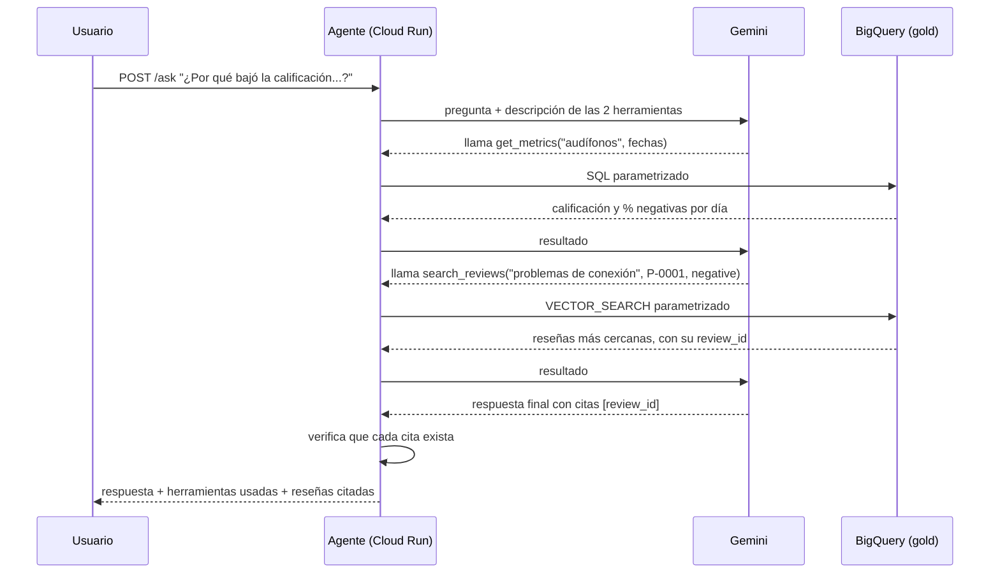
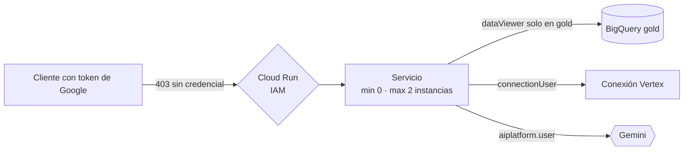

# 07 · El agente

Responde preguntas de negocio como *"¿Por qué bajó la calificación de los audífonos esta semana?"* combinando dos fuentes: **la métrica** (qué pasó) y **las reseñas** (por qué). Corre en Cloud Run y usa Gemini con *function calling*.

## Qué es function calling

Gemini no consulta BigQuery. Se le describen dos funciones y, cuando las necesita, responde "llama a `get_metrics` con estos argumentos". Nuestro código ejecuta la función, le devuelve el resultado y el modelo sigue razonando con él. El modelo decide **qué** llamar; el código decide **qué se ejecuta de verdad**.



## Las dos herramientas

| Herramienta | Responde | Lee |
|---|---|---|
| `get_metrics(product_name, start_date, end_date)` | ¿Qué pasó? Calificación, % de reseñas negativas y tema principal por día | `gold.product_daily_metrics` |
| `search_reviews(query, product_id, sentiment, start_date, end_date, k)` | ¿Por qué? Las reseñas más cercanas en significado a un texto | `gold.review_embeddings` |

**Sin SQL libre.** Cada herramienta ejecuta una consulta fija y el modelo solo aporta valores para los parámetros (`@name`, `@start`…). Antes de ejecutar, `agent/tools.py` valida cada valor: fechas ISO, `product_id` con forma `P-0001`, sentimiento dentro de tres valores, `k` entre 1 y 10. Un argumento inválido no llega a BigQuery: se le devuelve al modelo como error para que lo corrija.

La alternativa (que el modelo escriba SQL) es más flexible, pero impredecible y más difícil de proteger. Con dos herramientas cerradas, lo peor que puede pasar es una consulta equivocada de entre dos posibles.

## Las barreras contra respuestas inventadas

El primer intento fue un fracaso instructivo. Con la pregunta del incidente, Gemini **no llamó a `search_reviews`** y respondió con cinco reseñas y cinco IDs completamente inventados, con aspecto creíble:

> *"Se desconectan a cada rato, es imposible usarlos" [a1b2c3d4-e5f6-7890-1234-567890abcdef]*

Lo detectó una verificación que ya existía: el campo `cited_reviews` salía vacío porque ninguno de esos IDs estaba entre los que devolvió una herramienta. De ahí salieron tres barreras:

| Barrera | Qué hace |
|---|---|
| **Prompt estricto** | Obliga a llamar a `search_reviews` antes de decir qué escribieron los clientes, a comparar dos períodos para hablar de tendencias y a citar el `review_id` exacto |
| **Verificación en el servidor** | Cada ID entre corchetes debe ser uno que una herramienta devolvió. Si hay uno inventado, el servidor se lo dice al modelo y le da **un** reintento |
| **Rechazo** | Si el reintento también falla, la respuesta se descarta: *"No pude respaldar la respuesta con reseñas reales"*, con `verified: false` |

La respuesta incluye `cited_reviews` con las reseñas completas (texto, fecha, distancia) para que quien lea pueda comprobar cada afirmación.

**Un detalle que costó un error:** Gemini agrupa varios IDs en un mismo corchete, `[id1, id2]`. La primera verificación trataba el corchete completo como un único ID y rechazaba respuestas correctas. Ahora separa por comas y solo revisa lo que tiene forma de ID, para que `[P-0001]` no se confunda con una reseña. `tests/test_agent.py` cubre estos casos sin llamar a GCP.

## Seguridad y costo



| Decisión | Efecto |
|---|---|
| Sin `allUsers` como invoker | Sin credencial de Google el servicio responde 403. No es público. |
| Cuenta de servicio propia | `bigquery.dataViewer` **solo sobre el dataset gold**; no puede leer bronze ni silver |
| `max_instance_count = 2` | Techo de gasto aunque alguien inunde el endpoint |
| `min_instance_count = 0` | Escala a cero: no se paga nada en reposo (el nivel gratis cubre 2 millones de peticiones al mes) |
| Límite de 500 caracteres por pregunta y 6 llamadas a herramientas | Un bucle desbocado del modelo cuesta dinero |

Lo que sí consume es Gemini: cada pregunta hace dos o tres llamadas al modelo y una búsqueda vectorial, centavos por cada cientos de preguntas.

## Probarlo

**Localmente, con tus credenciales, sin desplegar nada:**

```bash
echo "¿Por qué bajó la calificación de los audífonos esta semana?" | python agent/ask_local.py --project <PROYECTO>
```

La pregunta entra por stdin porque la consola de Windows corrompe las tildes en los argumentos de la línea de comandos (el modelo recibía `aud�­fonos` y respondía mal).

**Desplegado:**

```bash
bash scripts/deploy_agent.sh            # Cloud Build + nueva revisión en Cloud Run
URL=$(terraform -chdir=infra output -raw agent_url)
curl -X POST "$URL/ask" \
  -H "Authorization: Bearer $(gcloud auth print-identity-token)" \
  -H "Content-Type: application/json" \
  -d '{"question": "¿Por qué bajó la calificación de los audífonos esta semana?"}'
```

La primera vez: `terraform apply` (identidad), `bash scripts/deploy_agent.sh` (imagen), luego `deploy_agent = true` en `terraform.tfvars` y `terraform apply` de nuevo (servicio). Cloud Run necesita que la imagen exista antes de crear el servicio.

## El escenario del incidente

Para que la pregunta tenga respuesta, los datos necesitan una caída. `scripts/backfill.sh` publica cinco días normales (2 al 6 de octubre, con `--event-days-ago`) y el incidente sembrado cae el 7:

| Día | Reseñas de P-0001 | Calificación | % negativas |
|---|---|---|---|
| 2 – 6 oct | 11 – 18 por día | 3,6 – 4,2 | 11 – 36 % |
| **7 oct** | **176** | **1,68** | **93 %** (tema: conectividad) |

Respuesta real del agente en Cloud Run:

> La calificación de los audífonos inalámbricos SoundPods (P-0001) bajó esta semana. Fue de 3,92 entre el 2 y el 4 de octubre, con 20,6 % de reseñas negativas. El 7 de octubre fue de 1,68 con 93,2 % de reseñas negativas, y el principal tema negativo fue la conectividad. Los clientes reportan que la señal Bluetooth se corta, se desconectan a cada rato y el teléfono no los reconoce bien [5 review_id verificados].

La primera versión de la pregunta, antes de tener los días de referencia, recibió una respuesta honesta: *"No puedo confirmar que la calificación haya bajado, porque no tengo datos de la semana anterior para comparar"*. El agente no fabricó una tendencia que los datos no mostraban.

## Límites conocidos

- **Promedios de promedios.** El modelo recibe una fila por día y calcula él mismo los promedios de varios días, sin ponderar por número de reseñas. Una cifra como "3,07 entre el 5 y el 7" es la media simple de tres promedios diarios. Para exactitud, la herramienta debería devolver el agregado del período.
- **Una respuesta tarda unos 15 segundos** (varias llamadas encadenadas a Gemini y BigQuery, más el arranque en frío si el servicio estaba en cero).
- **Sin memoria entre preguntas.** Cada `POST /ask` es independiente.
