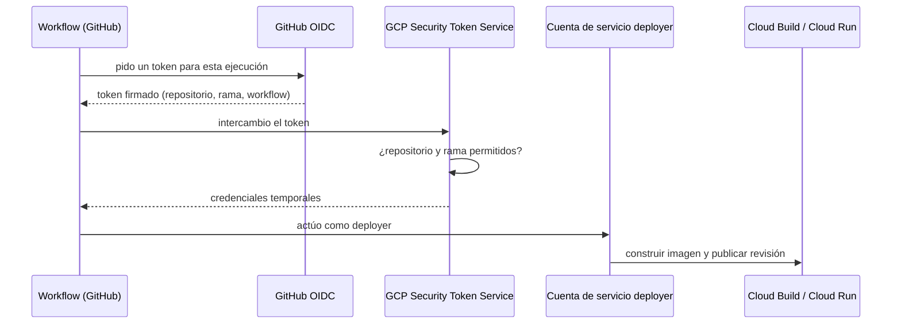
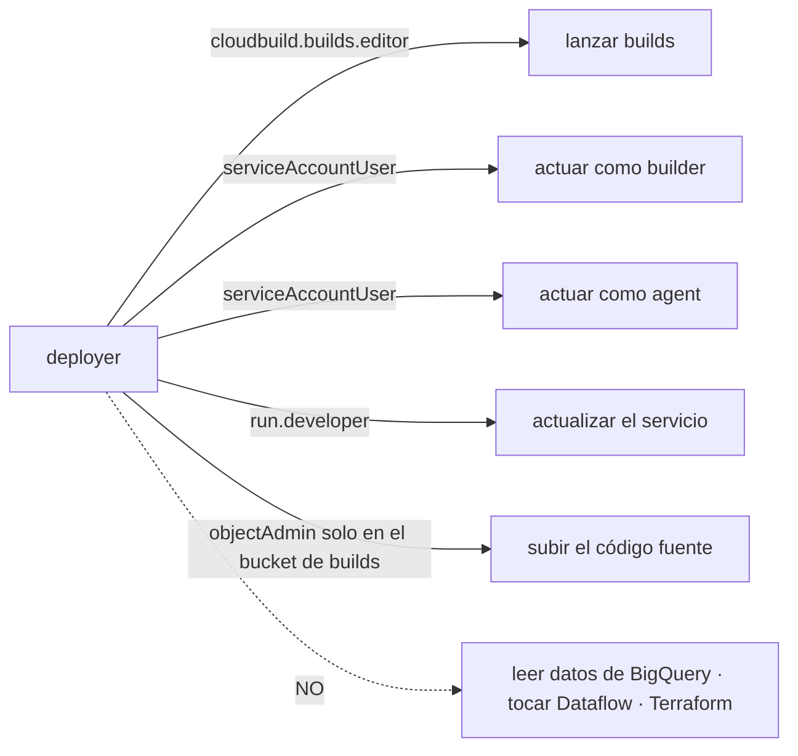
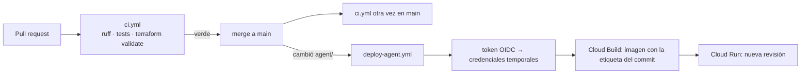

# 08 · CI/CD con GitHub Actions

Dos automatizaciones, con propósitos distintos:

| Workflow | Cuándo corre | Qué hace | ¿Toca GCP? |
|---|---|---|---|
| `ci.yml` | En cada PR y en cada push a `main` | Lint, tests y validación de Terraform | No |
| `deploy-agent.yml` | Push a `main` que cambie `agent/` (o a mano) | Construye la imagen y publica una revisión de Cloud Run | Sí |

El CI no necesita credenciales: solo lee el código. Únicamente el despliegue habla con GCP, y por eso es el que necesita una identidad.

## El problema: ¿cómo entra GitHub a GCP?

Un workflow corre en una máquina de GitHub que GCP no conoce. Hay dos formas de darle acceso:

| | Clave de cuenta de servicio | Workload Identity Federation |
|---|---|---|
| Cómo funciona | Se descarga un archivo JSON y se guarda como secreto en GitHub | GitHub presenta un token firmado y temporal; GCP lo cambia por credenciales de minutos |
| Si se filtra | Da acceso al proyecto hasta que alguien la revoque | No hay nada permanente que filtrar |
| Rotación | Manual (y se olvida) | No aplica |
| Restricción por repositorio o rama | No | Sí |
| Configuración | Mínima | Una sola vez, en Terraform |

Este proyecto usa **Workload Identity Federation**, que es lo habitual en proyectos reales.

## Cómo funciona



La parte que protege es la **condición del proveedor** (`infra/github_actions.tf`):

```
assertion.repository == "Danzstorm/review-pulse-gcp" && assertion.ref == "refs/heads/main"
```

Sin ella, cualquier repositorio de GitHub podría pedir credenciales a este proveedor. Con ella, solo este repositorio y solo desde `main`: ni un fork ni un pull request pueden desplegar.

## Qué puede hacer el deployer (y qué no)



Todos son permisos de despliegue; ninguno da acceso a los datos. El deployer actúa como la cuenta del *builder* para construir y como la del *agente* para publicar la revisión (Cloud Run exige poder "actuar como" la cuenta con la que correrá el servicio).

## Configuración en el repositorio

Los identificadores se guardan como **variables** del repositorio (no secretos: son nombres, no credenciales). Se cargan una vez desde los outputs de Terraform:

| Variable | Origen |
|---|---|
| `PROJECT_ID`, `REGION` | `terraform output project_id` / `region` |
| `BUILDER_EMAIL`, `BUILDS_BUCKET`, `AGENT_IMAGE` | outputs del mismo nombre |
| `WIF_PROVIDER`, `DEPLOYER_EMAIL` | `terraform output wif_provider` / `deployer_email` |

```bash
gh variable set PROJECT_ID --body "$(terraform -chdir=infra output -raw project_id)"
```

`scripts/deploy_agent.sh` es el mismo script que se usa a mano. En CI no existe el estado de Terraform, así que cada valor se toma de la variable de entorno del mismo nombre en mayúsculas si existe, y de `terraform output` si no.

## El flujo completo



La imagen lleva como etiqueta el hash corto del commit, así que cada revisión de Cloud Run se asocia con el código exacto que la construyó.

## Decisiones y detalles que importan

- **`ruff.toml` fijado en el repositorio.** Sin él, el lint local dependía de la configuración global de cada máquina: en la mía aparecían 25 errores que en CI no existían, y al fijar las reglas por defecto aparecieron 5 distintos y reales (dos `lambda` asignadas, una variable `l`). Ahora local y CI aplican las mismas reglas.
- **`concurrency` en el despliegue.** Dos pushes seguidos no despliegan a la vez; el segundo espera al primero.
- **Terraform no revierte los despliegues.** El servicio de Cloud Run ignora los cambios de imagen (`ignore_changes`): el workflow publica revisiones nuevas y un `terraform apply` posterior no las deshace.
- **Infraestructura fuera del CI.** `terraform apply` sigue siendo manual. Automatizarlo exigiría un estado remoto (hoy es local) y una identidad con permisos de administración: un riesgo mayor que el beneficio en un proyecto de este tamaño.

## Lo que falló al probarlo de verdad

El primer despliegue desde GitHub falló dos veces seguidas, cada una por un permiso que faltaba. Los permisos de un despliegue no se deducen leyendo la documentación: se descubren ejecutándolo, y cada error enseña algo.

| Intento | Error | Causa real | Solución |
|---|---|---|---|
| 1 | *"The user is forbidden from accessing the bucket … serviceusage.services.use"* | El mensaje de `gcloud` sugiere un permiso que el deployer **ya tenía**. Lo que faltaba era `storage.buckets.get`: `gcloud` comprueba que el bucket de código fuente existe antes de subir, y `roles/storage.objectAdmin` no lo incluye (se comprobó listando los permisos del rol) | `roles/storage.legacyBucketReader` sobre ese bucket |
| 2 | *"Permission `artifactregistry.repositories.downloadArtifacts` denied"* | La imagen ya se había construido, pero Cloud Run exige que quien despliega una revisión pueda **leer** la imagen | `roles/artifactregistry.reader` sobre el repositorio |
| 3 | — | — | Despliegue correcto: revisión nueva en Cloud Run, y el agente respondió verificado |

La autenticación con Workload Identity Federation funcionó desde el primer intento: ambos errores ocurrieron *después* de que GCP aceptara el token de GitHub, ya con la identidad del deployer.

**Cómo se diagnosticó.** El mensaje de error nombra un permiso que a veces no es el que falta. Dos pasos ahorran tiempo: leer el error completo (`gh run view --log-failed`) y comprobar qué permisos incluye realmente el rol con `gcloud iam roles describe`.

## Probarlo

```bash
gh workflow run deploy-agent.yml          # despliegue manual
gh run list --workflow deploy-agent.yml   # ver el resultado
```
