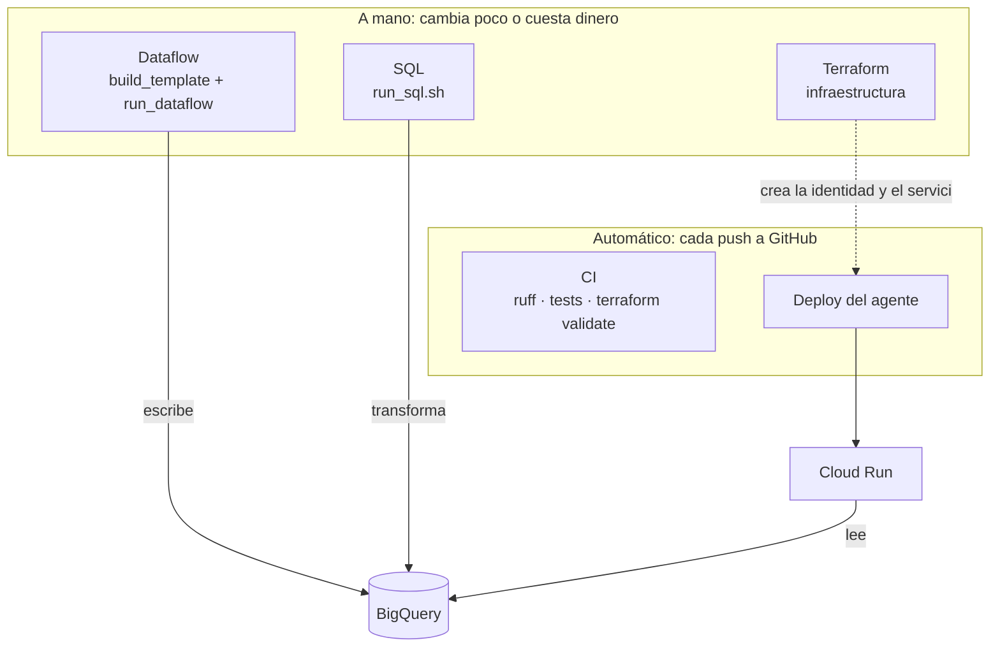
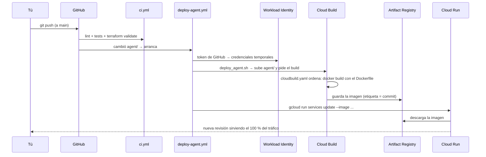
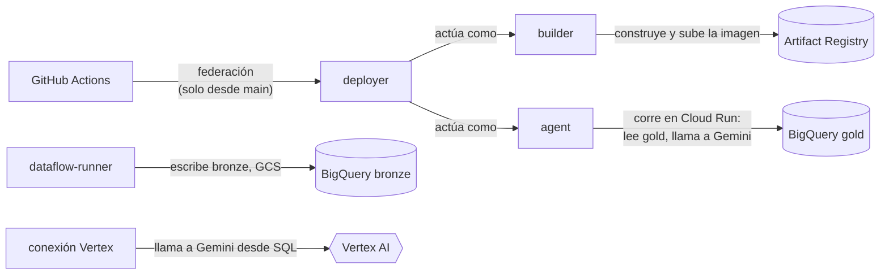

# 09 · El mapa del despliegue

Este capítulo responde a una pregunta: **¿por qué desplegar este proyecto parece tan complicado?** La respuesta corta es que no es un despliegue, son cinco, y cada uno tiene un ciclo de vida distinto.

## Las cinco piezas y cómo llega cada una a GCP

| Pieza | Qué es | Cómo se despliega | Quién lo dispara | Cuándo |
|---|---|---|---|---|
| **Infraestructura** | Pub/Sub, buckets, datasets, permisos, conexión a Vertex AI, Cloud Run, identidad de GitHub | `terraform apply` | Tú, a mano | Rara vez: al crear el proyecto o al cambiar recursos |
| **Pipeline de streaming** | El job de Dataflow | `build_template.sh` (imagen + plantilla) y `run_dataflow.sh` (lanza el job) | Tú, a mano | Solo cuando hay datos que procesar: **cobra mientras corre** |
| **Capas de datos (SQL)** | Silver, enriquecimiento con Gemini, embeddings, métricas | `run_sql.sh <archivo.sql>` | Tú, a mano | Después de que lleguen datos nuevos |
| **Agente** | La API en Cloud Run | `deploy_agent.sh` | **GitHub Actions**, solo | En cada cambio a `agent/` que llegue a `main` |
| **Código y calidad** | Lint, tests, validación de Terraform | `ci.yml` | **GitHub Actions**, solo | En cada PR y cada push |



**Por qué no está todo automatizado.** Es una decisión, no una carencia:

- **Dataflow cuesta por hora encendido.** Un despliegue automático en cada commit lo dejaría corriendo. Se lanza a mano, se apaga con `stop.sh`.
- **Terraform destruye cosas si se equivoca.** Automatizarlo exige estado remoto (hoy es un archivo local) y una identidad con permisos de administración: un riesgo mayor que el beneficio en un proyecto de este tamaño.
- **El SQL depende de que haya datos nuevos**, no de que cambie el código.
- **El agente sí se automatiza** porque cambia con el código, es barato de desplegar y, si algo sale mal, se vuelve atrás en segundos.

## El camino de un cambio al agente, paso a paso

Qué ocurre desde que editas `agent/agent.py` hasta que la respuesta nueva llega a un usuario:



Cada archivo tiene un papel único:

| Archivo | Papel | Se podría quitar si… |
|---|---|---|
| `agent/*.py`, `requirements.txt` | El agente y sus dependencias | — |
| `agent/Dockerfile` | La receta de la imagen: Python + dependencias + código | Usas *buildpacks* (`gcloud run deploy --source .`), con menos control |
| `agent/cloudbuild.yaml` | La orden de construcción: usa el Dockerfile y envía los logs solo a Cloud Logging | Construyes con la cuenta por defecto de Cloud Build, con permisos más amplios |
| `scripts/deploy_agent.sh` | Une construir y publicar. Es el mismo en tu máquina y en CI | Escribes esos comandos directamente en el workflow |
| `.github/workflows/deploy-agent.yml` | Cuándo y con qué identidad se despliega en GitHub | Despliegas siempre a mano |
| `.github/workflows/ci.yml` | Revisa cada cambio antes del merge | Confías en revisar a mano |
| `infra/github_actions.tf` | La identidad sin llaves de GitHub y sus permisos | Usas una clave de cuenta de servicio (menos segura) |
| `infra/agent.tf` | La cuenta del agente y el servicio de Cloud Run | — |

## Quién actúa como quién

La parte que más confunde es la cantidad de cuentas de servicio. Cada una existe porque separa **lo que se hace** de **lo que se puede hacer**:



| Cuenta | La usa | Puede | No puede |
|---|---|---|---|
| `deployer` | GitHub Actions | Lanzar un build, actualizar el servicio, actuar como `builder` y `agent` | Leer datos de BigQuery |
| `builder` | Cloud Build | Subir imágenes al repositorio | Desplegar o tocar datos |
| `agent` | El servicio en Cloud Run | Leer el dataset `gold`, llamar a Gemini | Leer bronze o silver |
| `dataflow-runner` | Dataflow | Escribir en bronze y en el bucket | Tocar gold o el agente |
| conexión de Vertex | BigQuery, al ejecutar `ML.GENERATE_TEXT` | Llamar a Gemini | Cualquier otra cosa |

Si una se compromete, el daño queda acotado a su alcance. Un solo "superusuario" sería más fácil de configurar y mucho peor ante un error o una filtración.

## Qué es esencial y qué es "profesional pero opcional"

| Esencial para que funcione | Buena práctica, se podría simplificar |
|---|---|
| Dockerfile y `requirements.txt` | `cloudbuild.yaml` y la cuenta `builder` propia |
| Terraform para la infraestructura | Workload Identity Federation (con una clave también funcionaría) |
| Una forma de desplegar el agente | El CI automático y el despliegue en cada push |
| Validación de argumentos y verificación de citas | `ruff.toml` fijado y `terraform validate` en CI |

Para aprender, lo esencial es la columna izquierda. La derecha es lo que separa un proyecto de portafolio de uno que un equipo puede operar sin miedo.

## Qué cambiaría en un proyecto real

- **Estado de Terraform remoto** (un bucket con bloqueo) y `terraform plan` automático en cada PR, con `apply` tras aprobación.
- **Dos entornos** (`dev` y `prod`) en proyectos separados, con la misma infraestructura parametrizada.
- **Despliegue con aprobación** para producción, y revisiones de Cloud Run con tráfico gradual (10 %, luego 100 %).
- **Pruebas de integración en CI** contra un dataset de prueba, no solo pruebas unitarias.
- **Alertas** sobre errores del agente y sobre el gasto de Gemini.

## Volver atrás

Cada despliegue crea una *revisión* de Cloud Run y las anteriores se conservan. Si una versión nueva responde mal:

```bash
gcloud run revisions list --service=review-pulse-agent --region=us-central1
gcloud run services update-traffic review-pulse-agent --region=us-central1 \
  --to-revisions=<REVISION_ANTERIOR>=100
```

Es instantáneo y no requiere reconstruir nada.
